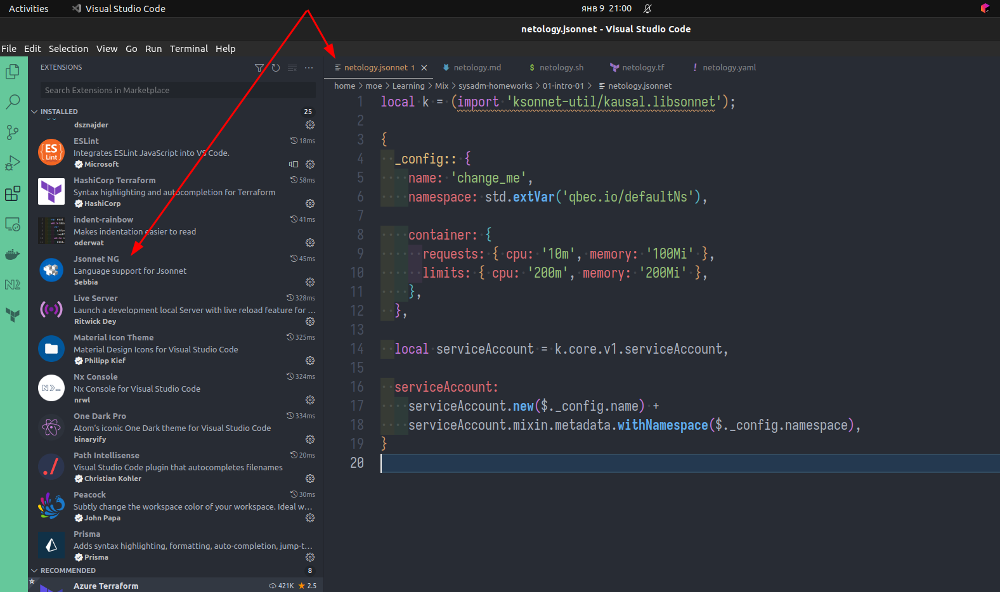
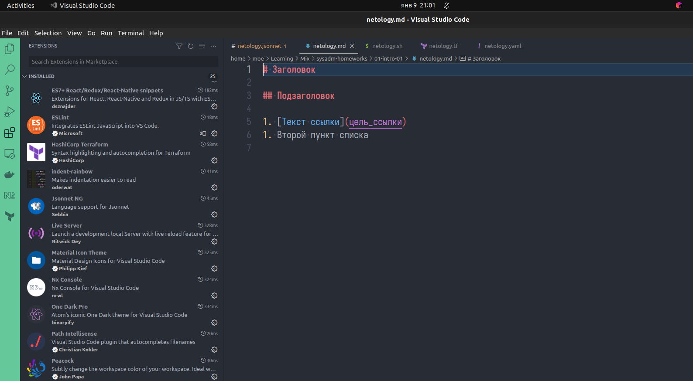
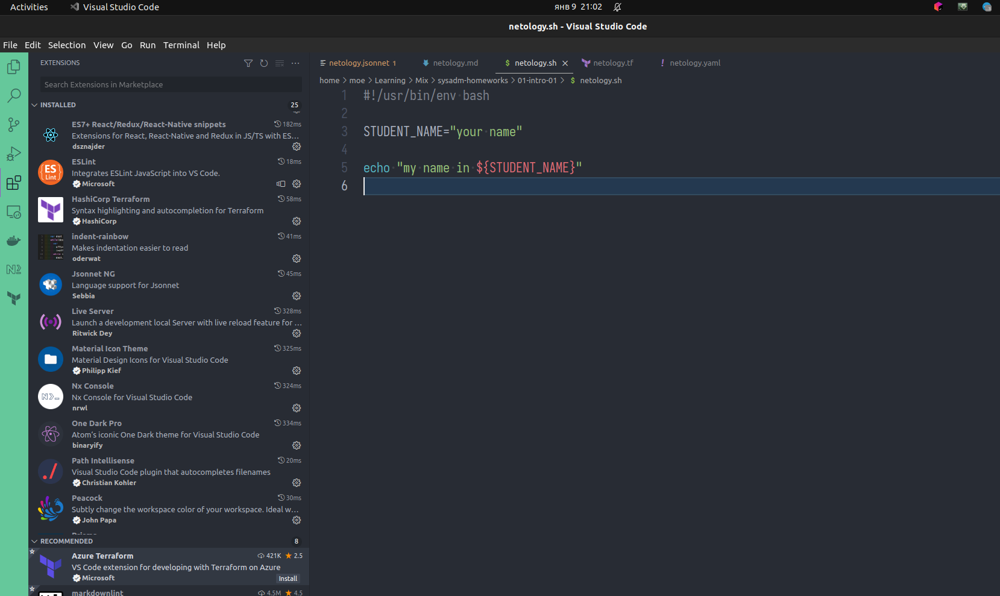
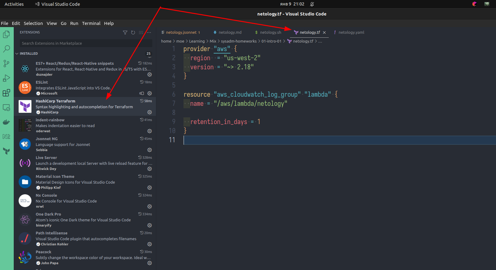
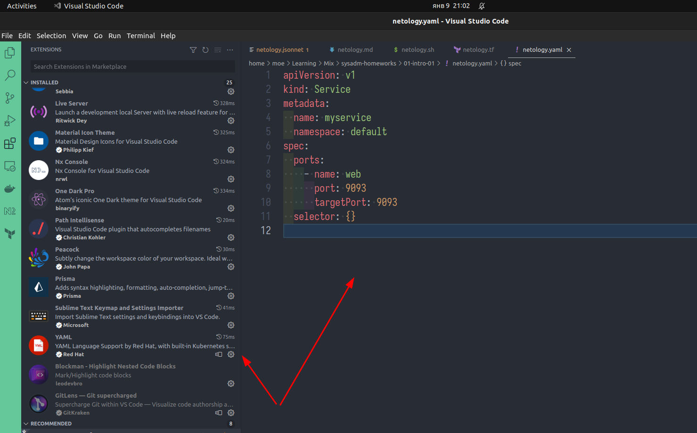

## Задание 1. Подготовка рабочей среды

Зачем монструозный PyCharm, есть есть маленький VSC?

- Jsonnet

- Markdown

- Bash

- Terraform

- Yaml

## Задание 2. Описание жизненного цикла задачи (разработки нового функционала)

- постановка задачи product owner'ом
- анализ задачи и создание ТЗ на задачу аналитиком
- оценка задачи по времени выполнения и обсуждение задачи - тимлидом совместно с разработчиком
- выполнение задачи разработчиком
- прохождение код-ревью выполненной задачи
- тестирование выполненной задачи тестировщиком
- выкладывание протестированной задачи на прод девопсом